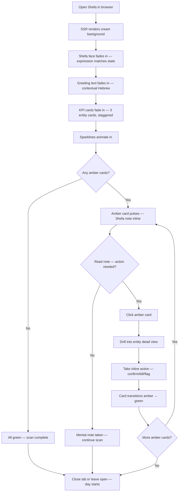
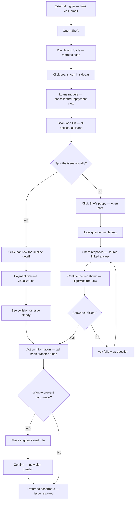
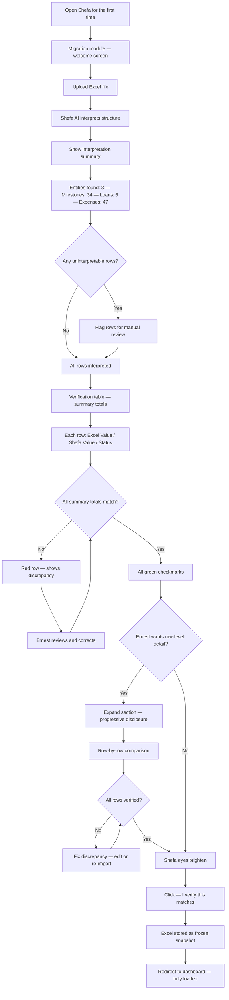
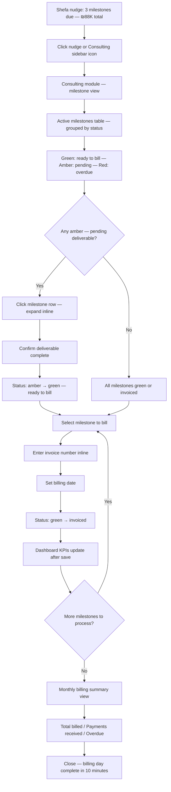

# UX Design Specification — Shefa Investments

**Author:** Ernest
**Date:** 2026-03-09

---

## Executive Summary

### Project Vision

Shefa Investments is a personal AI-powered financial command center that brings Claude desktop's design philosophy — warm neutrals, generous whitespace, minimal chrome, and progressive disclosure — to a data-dense financial context. The product replaces Excel spreadsheets with a unified Hebrew-first system delivering full financial visibility in 30 seconds, anchored by Shefa — a golden-eyed puppy AI companion that is the product's emotional core.

The design challenge is translating a conversation-first aesthetic (Claude) into a data-first product (financial dashboard) without losing the warmth, calm, and focus that make Claude feel good.

### Design DNA: Claude Desktop Principles Applied to Financial Data

| Claude Principle | Shefa Adaptation |
|---|---|
| Warm neutrals | Warm cream base + golden Shefa accent palette. No cold fintech blues. Gold replaces Claude's coral. |
| Generous whitespace | Spacious KPI cards, generous table row height, breathing room between sections. Data-dense does not mean cramped. |
| Minimal chrome | Clean sidebar navigation (collapsible), no toolbar clutter, no decorative elements. Navigation is quiet. |
| Typography-first | Hebrew-optimized warm sans-serif. Numbers get clear monospace treatment. Hierarchy through size/weight, not decoration. |
| Centered focus | Dashboard morning briefing is the visual center. Shefa greeting anchors the top. Clear visual flow: greeting → KPIs → status items. |
| Right-side panel | Shefa AI chat panel is collapsible and persistent. In RTL context, the logical inline-end position is the left side — mirroring Claude's right panel. Panel position is a key design decision to resolve. |
| Subtle motion | Shefa's micro-expressions, smooth panel transitions, status color changes. No theatrical animations. |
| Progressive disclosure | Dashboard shows totals first. Drill into entity. Drill into detail. Migration shows summary then rows. Never all data at once — layers of depth, user controls the pace. |

### What Shefa Inherits, Adapts, and Invents

| Category | Elements |
|---|---|
| **Inherits directly** | Warm neutral palette, generous whitespace, minimal chrome, subtle motion, typography-first hierarchy, progressive disclosure |
| **Adapts for context** | Right panel → RTL-aware panel positioning, centered conversation → centered dashboard, clean input area → data entry forms with same spaciousness |
| **Invents new** | Shefa puppy character as emotional anchor (Claude has no mascot), amber/green/red status system on warm base, KPI card grid, entity drill-down navigation, migration side-by-side verification layout |

### Target Users

**Ernest (sole user for Phase 0 + 0.5):** Solo operator managing 3 entities, 10+ clients, 6+ loans. Not tech-savvy. Hebrew-speaking. Desktop browser only (1280px+). Currently has no structured daily financial routine — everything lives in his head and in Excel. Wants to feel in control, not anxious. The product must feel like opening his favorite app, not like operating enterprise software.

### Key Design Challenges

1. **Data density on a warm canvas** — Financial command centers are inherently data-dense (KPIs, tables, schedules, timelines). Claude's warmth comes from spaciousness. Making both coexist at 1280px without feeling cramped or empty is the central UX challenge.

2. **RTL-native Claude aesthetic** — Claude desktop was designed LTR. Every layout pattern (panel positioning, reading flow, visual hierarchy) must be rethought for RTL Hebrew — not flipped with CSS, but designed natively. The Shefa AI panel position (left in RTL? right regardless?) is a key decision.

3. **AI companion in a data product** — Claude desktop IS a conversation. In Shefa, the conversation is a side panel alongside dashboards and tables. The AI must feel integrated, not bolted on — present without dominating, accessible without blocking the data view.

4. **Emotional warmth in a trust-critical context** — The puppy character and warm palette must coexist with zero-error financial precision. Playfulness in the wrong context (e.g., during migration verification) would undermine trust.

5. **One experience across modules** — Dashboard, consulting, and loans are separate modules architecturally but must feel like one fluid product. Navigation between them should be as seamless as scrolling, not app-switching.

### Design Opportunities

1. **The Shefa greeting as emotional anchor** — No financial tool has a character-driven welcome. The morning briefing with a golden-eyed puppy sets an emotional tone competitors can't replicate. This is the "Saturday Morning Test" in design form.

2. **Claude-grade polish in fintech** — Most financial tools look either cold-corporate or cluttered-functional. Bringing Claude's warmth and whitespace to financial data creates a genuinely novel visual identity.

3. **Progressive disclosure as trust-builder** — The migration ceremony (totals first, drill down on demand) and dashboard (master view → entity → detail) naturally use Claude's progressive disclosure pattern. Each layer reveals more and builds confidence.

4. **Status semantics as gentle alerts** — Green/amber/red on a warm cream base, with sufficient contrast but not screaming at the user. Amber items pulse gently — they ask for attention, they don't demand it.

## Core User Experience

### Defining Experience

The defining interaction is the **morning open**: Shefa's golden-eyed puppy greets you first, then the numbers fade in around it. Within 30 seconds — zero clicks — you know the state of your entire financial empire. The product earns its place by making this moment feel warm, not transactional. If the morning open feels like checking a dashboard, the UX has failed. If it feels like walking into your living room and everything is exactly where it should be, it has succeeded.

The core loop: Open → See → Know → Act (only if needed) → Close with confidence.

### Platform Strategy

- **Desktop-only web application** — minimum 1280x800 viewport, mouse/keyboard interaction
- **No offline, no mobile, no responsive** — optimized for one context: Ernest at his desk
- **Hebrew-only for Phase 0 + 0.5** — RTL-native design, not CSS-flipped LTR
- **Browser support:** Chrome, Firefox, Safari, Edge (latest 2 versions)
- **Deployment:** Railway with custom domain, staging + production environments

### Interaction Model

| Element | Pattern | Rationale |
|---|---|---|
| **Navigation** | Collapsed icon sidebar, expands on hover (~56px collapsed) | Minimal chrome, maximum canvas for data. Modern and stylish (Linear, Arc pattern). |
| **Shefa AI panel** | Puppy face always visible bottom-left. Click to expand chat upward as floating overlay. | Persistent emotional anchor. Zero layout shift. Natural RTL end-corner position. Intimate conversation space. |
| **Nudges** | Inline on dashboard — relevant card pulses amber with Shefa's note attached | No extra UI layer. The data tells the story. Nudge lives where the action is. |
| **Morning open** | Shefa's face appears first, numbers fade in around it | The puppy IS the product. Emotional hook before data. |
| **KPI cards** | Big numbers + sparkline mini-charts. Shefa commentary only on amber cards. | Sparklines add trend context. Commentary is earned — only where attention is needed. Clean cards stay clean. |
| **Module switching** | Sidebar icon click. Main content area changes. No page reload feel. | Seamless, like turning a page. Module boundaries invisible to user. |
| **Migration verification** | Simple table: Excel Value / Shefa Value / Status columns. Summary totals at top, expandable rows. | Functional, no over-design. Trust comes from accuracy, not ceremony visuals. |

### Critical Success Moments

1. **First morning open** — Shefa greets Ernest, numbers match his mental model of reality. He exhales. "This is right." If any number feels wrong, trust is broken before it starts.
2. **Migration verification** — Every total matches the Excel. Green checkmarks accumulate. Ernest clicks "I verify." The moment the spreadsheet becomes unnecessary.
3. **First Shefa catch** — An amber card appears for something Ernest would have missed. The system is smarter than the spreadsheet. This is the moment Shefa earns permanent trust.
4. **Billing day in 10 minutes** — What used to take 2 hours in Excel takes 10 minutes. Ernest processes 3 milestones and the dashboard updates immediately. No going back.
5. **Saturday morning voluntary open** — Ernest opens Shefa because he wants to, not because he has to. The living room test. Product-market fit confirmed.

### Experience Principles

1. **Living room, not cockpit** — Warm, comfortable, personal. You want to be here. Data is present but never aggressive. The cream palette, the puppy, the breathing room — they all serve this feeling.
2. **Show first, ask never** — The dashboard answers before you question. Zero clicks to full picture. If you have to go looking for information, the UX has failed.
3. **Earned attention** — Amber cards, Shefa notes, and nudges only appear when they matter. Most of the screen is quiet most of the time. Silence is a feature.
4. **Fade in, don't slam** — Shefa appears first, numbers follow. Panels slide, don't snap. Status colors pulse gently, don't flash. Every transition is smooth and purposeful.
5. **Trust through proof** — No "trust us" — show the numbers, let Ernest verify, trace every value to its source. Trust is built incrementally through accuracy, not promised through words.

## Desired Emotional Response

### Primary Emotional Goals

| Emotional Goal | What It Feels Like | Design Lever |
|---|---|---|
| **Intimacy** | "This tool knows me. It's mine." | Shefa greets by context, not by script. The puppy's expression matches the moment. Data is personal, not generic. |
| **Calm confidence** | "Everything is under control. I don't need to worry." | Zero-click dashboard. Quiet when things are fine. Gentle amber when they're not. Living room warmth. |
| **Earned delight** | "This is beautiful AND useful. I want to be here." | Claude-grade polish. Sparklines. Smooth transitions. The Saturday Morning Test. |
| **Trust through proof** | "I don't hope it's right — I know it is." | Source-linked numbers. Migration verification. Confidence tiers on AI. Green checkmarks that accumulate. |

### Emotional Journey Map

| Moment | Target Emotion | How We Create It |
|---|---|---|
| **First visit (migration)** | Nervous → Reassured → Verified → Trusting | Progressive disclosure. Summary totals match first. Row-by-row green checkmarks. "I verify" gate gives Ernest control. |
| **Morning open** | Anticipation → Warmth → Confidence → Calm | Shefa's face appears first (warmth). Numbers fade in (confidence). Everything is where it should be (calm). Close the tab — the day is handled. |
| **Shefa nudge arrives** | Curiosity → Gratitude | Amber card pulses gently — not alarming, inviting. Shefa's note is short and actionable. "She caught something I would have missed." |
| **Billing day workflow** | Focused → Efficient → Accomplished | Clear status colors. One milestone at a time. Dashboard updates after each save. Monthly summary at the end — "₪340K billed. Done." |
| **Something goes wrong** | Protected → Informed → Calm | System catches the error visibly. Clear explanation of what happened. No data lost. Clear path to resolution. No panic, no mystery. |
| **Fire drill (loan crisis)** | Urgent → Oriented → Empowered | Shefa answers the question with source-linked data. Payment timeline shows the collision. Ernest calls the bank with full context in under 2 minutes. |
| **Returning next day** | Familiarity → Comfort | Same living room. Shefa remembers context. Nothing moved, nothing changed unexpectedly. Reliable warmth. |

### Micro-Emotions

| Pair | We Choose | Design Implication |
|---|---|---|
| Confidence vs. Confusion | **Confidence** | Always know where you are. The sidebar icon highlights and the content area title are enough. No dead ends. |
| Trust vs. Skepticism | **Trust** | Every number is source-linked. Confidence tiers on AI. Migration verification is proof, not promise. Never show a number you can't trace. |
| Calm vs. Anxiety | **Calm** | Living room palette. Gentle status colors. Bad news delivered with warmth, not alarm. Shefa's concerned expression — ears down, eyes soft — not a red siren. |
| Delight vs. Satisfaction | **Delight** | Claude-grade polish elevates "functional" to "beautiful." Sparklines, smooth transitions, the puppy's micro-expressions. Satisfaction is table stakes. Delight is the differentiator. |

### Emotions to Avoid

| Avoid | How We Prevent It |
|---|---|
| **Overwhelmed** | Progressive disclosure everywhere. Dashboard shows totals — detail is one click deeper, not visible by default. Max 3 nudges/day. |
| **Patronized** | Shefa is a companion, not a teacher. No tutorials, no "Did you know?" tooltips. The UI is obvious enough to not need explanation. |
| **Anxious** | Even bad news is warm. Amber, not red, for most alerts. Shefa's tone shifts to serious but never alarming. Error states are clear and recoverable. |
| **Lost** | Collapsed sidebar always visible. Shefa's face always in the corner. Module switching is seamless. No deep navigation trees. Two levels maximum: module → detail. |

### Emotional Design Principles

1. **Warmth is the default, seriousness is earned** — Shefa is playful by default. It shifts to serious only when the context demands it (financial analysis, error states, migration verification). The shift itself signals "pay attention" without needing alerts.

2. **Silence communicates safety** — When Shefa has nothing to say, that IS the message: everything is fine. An empty nudge queue is a green flag. Users should feel relieved by quiet, not worried by it.

3. **Error ≠ failure** — When something goes wrong, the emotional sequence is: protected (system caught it) → informed (here's what happened) → calm (nothing is lost, here's how to fix it). Never blame the user. Never show raw technical errors.

4. **Delight is in the details** — The sparkline that shows an upward trend. Shefa's ears perking up when revenue is good. The smooth fade when numbers load. These micro-moments are what make Ernest open the app on Saturday morning.

5. **Intimacy scales to one** — This is a personal tool. Every interaction should feel like it was designed for Ernest specifically. No generic dashboards, no templated reports. The data is his, the puppy is his, the living room is his.

## UX Pattern Analysis & Inspiration

### Inspiring Products Analysis

| Product | What It Does Right | What Shefa Takes |
|---|---|---|
| **Claude Desktop** | Warm cream palette, generous whitespace, minimal chrome, conversation feels intimate and focused. The artifact panel slides in without disrupting. Typography is clean and confident. | The entire emotional foundation. Cream base, warm sans-serif, spacious layouts, subtle transitions. The living room feeling. This is Shefa's design parent. |
| **Linear** | Proves a data-dense productivity tool can feel premium. Collapsed icon sidebar. Smooth page transitions. Every pixel is intentional. Clean tables without clutter. Keyboard shortcuts for power users. | The sidebar pattern (collapsed icons, expand on hover). The proof that data density and beauty coexist. Smooth module switching without page reload feel. Clean table styling. |
| **Stripe Dashboard** | The gold standard for financial data visualization. KPI cards with sparklines. Clear number typography. Professional without being cold. Revenue charts that tell a story at a glance. | KPI card design language. Sparkline treatment. Number typography (large, monospace, clear hierarchy). The standard for "financial data done beautifully." |
| **Apple Health** | Progressive disclosure perfected. Summary cards on top. Drill into any metric. Granular data available but never shown by default. Calm, personal, your-data-first. | Progressive disclosure pattern for dashboard → entity → detail. The feeling of "my data, organized for me." Summary-first, detail-on-demand. |

### Transferable UX Patterns

**Navigation Patterns:**

| Pattern | Source | Application in Shefa |
|---|---|---|
| Collapsed icon sidebar | Linear | ~56px collapsed, expands on hover. Module icons: Dashboard, Consulting, Loans, Expenses, Marketplace. Active module highlighted. |
| Persistent floating element | Intercom / WhatsApp Web | Shefa puppy face in bottom-left corner. Always visible, click to expand chat. Non-intrusive but never hidden. |
| Breadcrumb-free orientation | Linear | The sidebar highlight + page title is enough. No breadcrumb trails. Two levels max: module → detail view. |

**Data Visualization Patterns:**

| Pattern | Source | Application in Shefa |
|---|---|---|
| KPI cards with sparklines | Stripe Dashboard | Entity cards showing big number + trend line. Warm background, generous padding. Numbers in monospace. |
| Status-on-card | Stripe / GitHub | Amber pulse on cards needing attention. Shefa's note appears inline below the number. Clean cards stay clean. |
| Progressive drill-down | Apple Health | Dashboard totals → click entity card → entity detail with breakdowns → individual records. Each level reveals more. |

**Interaction Patterns:**

| Pattern | Source | Application in Shefa |
|---|---|---|
| Fade-in content loading | Claude Desktop | Numbers and cards fade in rather than pop. Shefa appears first, data follows. Skeleton states use warm cream tones, not gray flashes. |
| Floating overlay panel | Claude artifacts / Intercom | Shefa chat expands upward from bottom-left. Floats over content. Doesn't push or resize anything. Click outside to minimize. |
| Inline contextual actions | Linear | Milestone actions (confirm deliverable, enter invoice) happen inline on the row — no modal dialogs for simple operations. |

**Visual Patterns:**

| Pattern | Source | Application in Shefa |
|---|---|---|
| Warm neutral base | Claude Desktop | Cream/off-white background. Not stark white (#FFFFFF), not gray. Warm and inviting. |
| Accent through restraint | Claude (coral) → Shefa (gold) | Golden accent used sparingly — active states, the puppy's eyes, important numbers. Most of the UI is neutral. Gold means "look here." |
| Typography hierarchy | Stripe | Three levels: large monospace numbers (KPIs), medium sans-serif (labels/titles), small sans-serif (metadata/dates). Hebrew-optimized at all sizes. |

### Anti-Patterns to Avoid

| Anti-Pattern | Source Example | Why It Fails for Shefa |
|---|---|---|
| **Data wall** | Bloomberg Terminal | Every pixel filled with numbers. Impressive to look at, exhausting to use. Violates the living room principle. Ernest is not a trader. |
| **Chart overload** | Tableau / Power BI | Dashboards crammed with 8+ charts. Each chart fights for attention. Shefa needs 3-4 KPI cards and sparklines, not a chart gallery. |
| **Cold corporate blue** | Banking portals, SAP | Blue/gray/white palette signals "enterprise software." Opposite of the warmth we want. No blue in Shefa's palette. |
| **Modal dialog abuse** | Legacy enterprise apps | Every action triggers a modal: "Are you sure?" No. Inline actions, undo capability, and Shefa's gentle confirmations replace modals. |
| **Notification spam** | Consumer fintech (Mint) | Badge counts, push notifications, email digests, in-app banners. Shefa caps at 3 nudges/day. Silence is a feature. |
| **Onboarding tours** | Most SaaS products | Step-by-step guided tours with tooltips. Patronizing. If the UI needs a tour, the UI is too complex. Shefa's UI should be obvious. |

### Design Inspiration Strategy

**Adopt Directly:**
- Claude's warm neutral palette as the base canvas
- Linear's collapsed icon sidebar pattern
- Stripe's KPI card + sparkline treatment
- Apple Health's progressive disclosure (summary → detail)

**Adapt for Shefa:**
- Claude's right-side artifact panel → bottom-left floating chat (RTL context, persistent puppy presence)
- Stripe's number typography → Hebrew-optimized with RTL alignment
- Linear's smooth transitions → applied to Shefa's morning open sequence (puppy first, data fades in)
- Inline actions from Linear → adapted for Hebrew RTL milestone and loan workflows

**Avoid Completely:**
- Cold blue/gray fintech palettes — warmth is non-negotiable
- Chart-heavy dashboards — sparklines only, no chart galleries
- Modal dialogs for routine actions — inline or undo-based instead
- Notification overload — max 3 nudges/day, silence is safety
- Onboarding tours or tooltips — the UI must be self-evident

## Design System Foundation

### Design System Choice

**Tailwind CSS + shadcn/ui (Radix primitives)** — the themeable approach, heavily customized for Shefa's Claude-inspired warm minimalism.

### Rationale for Selection

| Factor | Why This Choice Wins |
|---|---|
| **Claude aesthetic** | Tailwind's utility-first approach lets you build any visual identity from scratch. No fighting a pre-built design system to look like Claude. You define the warmth, the spacing, the palette — pixel by pixel. |
| **Solo developer speed** | shadcn/ui gives you production-ready, accessible components (dialogs, dropdowns, tables, forms) that you copy into your project as YOUR code. Not a dependency — full ownership, full control. |
| **Hebrew RTL** | Built on Radix primitives which handle `dir="rtl"` natively. Tailwind's logical properties (`ps-4` instead of `pl-4`) make RTL styling natural, not retrofitted. |
| **Accessibility for free** | Radix handles keyboard navigation, focus management, screen reader announcements. You get NFR27-NFR30 compliance without building it yourself. |
| **Next.js 15 alignment** | shadcn/ui is the de facto standard for Next.js App Router projects. Server components work seamlessly. No hydration issues. |
| **Customization depth** | Every component lives in your codebase. Want a KPI card with sparkline? Build it once with Tailwind utilities on a Radix base. Want Shefa's amber pulse? One CSS animation class. |
| **No framework lock-in** | shadcn components are copied, not installed. If you outgrow a component, replace it. No upgrade migrations, no breaking changes from upstream. |

### Why NOT the Alternatives

| Alternative | Why Not |
|---|---|
| **Full custom** | Solo developer — can't build accessible dropdowns, modals, and form controls from scratch. Too much investment for components that should be commodities. |
| **Material UI (MUI)** | Heavy, opinionated Google aesthetic. Fighting MUI to look like Claude would take more effort than building on Tailwind. Bundle size concerns with server components. |
| **Ant Design** | Enterprise Chinese aesthetic. RTL support is an afterthought. Opposite of warm minimalism. |
| **Chakra UI** | Good but less Next.js 15 integration than shadcn. More opinionated styling that would need overriding. |

### Implementation Approach

**Base Layer:**
- Tailwind CSS with custom theme configuration (colors, spacing, typography, animations)
- CSS custom properties for Shefa's design tokens (palette, radii, shadows)
- `tailwind.config` as the single source of truth for the design system

**Component Layer:**
- shadcn/ui components copied into `src/components/ui/` — owned, not imported
- Each component themed to Shefa's warm minimalism via Tailwind classes
- RTL-aware from day one: logical properties, direction-aware layouts

**Custom Components (built on Radix/Tailwind base):**
- `KPICard` — entity metric card with sparkline, amber pulse state, optional Shefa note
- `StatusBadge` — green/amber/red with text label (not color-only, per NFR30)
- `ShefaAvatar` — puppy face component with micro-expression states (happy, thinking, concerned, serious)
- `ShefaChat` — floating bottom-left chat panel built on Radix Popover
- `DataTable` — RTL-native table with generous row height, expandable rows, inline actions
- `MigrationVerifier` — comparison table (Excel Value / Shefa Value / Status)

### Customization Strategy

**Design Tokens (defined in Tailwind config):**

```
Colors:
  cream:        warm off-white base (not #FFFFFF)
  cream-dark:   slightly darker for card backgrounds
  gold:         Shefa accent — puppy eyes, active states, important numbers
  gold-light:   subtle gold for hover states
  gold-dark:    pressed states
  text-primary: warm dark (not pure black)
  text-secondary: warm gray for metadata
  status-green: muted green on cream — healthy/ready
  status-amber: warm amber on cream — attention needed (pulse animation)
  status-red:   muted red on cream — overdue/error

Typography:
  sans:         Hebrew-optimized warm sans-serif (system font stack with Hebrew priority)
  mono:         Clean monospace for financial numbers (tabular figures)

Spacing:
  Generous — minimum 16px padding on cards, 12px table row height, 24px section gaps

Border Radius:
  Soft — 8px default, 12px for cards, 16px for panels (Claude-level softness)

Shadows:
  Minimal — subtle warm-toned shadows, no harsh drop shadows

Animations:
  fade-in:      300ms ease — for content loading
  pulse-amber:  gentle 2s infinite — for attention cards
  slide-up:     200ms ease-out — for Shefa chat panel
  micro-expression: 150ms ease — for Shefa's eye/ear movements
```

## Defining Experience

### The Core Interaction

**"Open Shefa and know everything in 30 seconds."**

If Ernest were describing Shefa to a friend, he'd say: *"I open it in the morning, and the puppy shows me my entire financial picture — no clicks, no searching, no spreadsheets. If something needs my attention, she tells me. If everything's fine, I close the tab and my day starts."*

This is not a feature. It's a feeling: **effortless financial awareness.** The defining interaction is the passive scan — the moment when seeing IS knowing. The closest analogy is checking your watch. You don't operate a watch. You glance at it and time is known. Shefa's morning open should work the same way for money.

### User Mental Model

**How Ernest currently solves this problem:**
- Opens 3+ Excel files, cross-references tabs manually
- Keeps critical dates and amounts in his head
- Checks bank portals separately for loan status
- Mental math to reconcile balances
- No alerts — he catches problems when they become urgent

**Mental model he brings to Shefa:**
- "My financial world fits on one screen" — he already has a mental dashboard, it's just in his head
- "The numbers should match what I know" — trust is verified, not assumed
- "Tell me when something is wrong, don't make me look for it" — the spreadsheet never warned him
- "I don't want to learn software, I want to see my money" — zero learning curve expectation

**What he loves about Excel:** Full control, can see the raw numbers, nothing is hidden
**What he hates about Excel:** Manual updates, no alerts, no cross-entity view, formula errors accumulate silently

**Expected frustration points:**
- If any number doesn't match his mental model during migration — instant distrust
- If he has to click more than once to find something — "where did they hide it?"
- If the AI gives wrong advice based on wrong data — trust collapse

### Success Criteria for Core Experience

**"This just works" indicators:**
1. Ernest opens Shefa → puppy appears → numbers fade in → he exhales. Under 3 seconds.
2. The dashboard total matches his mental number. No reconciliation needed.
3. An amber card appears for something he would have missed in Excel. He acts on it in one click.
4. He closes the tab feeling lighter, not heavier. Financial anxiety reduced, not increased.
5. Saturday morning: he opens Shefa voluntarily, not because he has to.

**Speed targets:**
- Morning scan: 30 seconds to full awareness (zero clicks)
- Act on nudge: 1 click from dashboard to action
- Monthly billing: 10 minutes vs. 2 hours in Excel
- Fire drill (loan question): Answer with source link in under 2 minutes

**Automatic behaviors:**
- KPI calculations update after every save — no manual refresh
- Amber nudges appear when thresholds are crossed — no manual checking
- Shefa's expression matches the financial state — no separate "status page"

### Novel vs. Established Patterns

**Pattern classification: Established patterns, combined in a novel way.**

| Pattern | Type | Source |
|---|---|---|
| Dashboard with KPI cards | Established | Stripe, every analytics tool |
| Collapsed sidebar navigation | Established | Linear, Arc, VS Code |
| Floating chat widget | Established | Intercom, WhatsApp Web |
| Progressive disclosure drill-down | Established | Apple Health, any master-detail |
| Sparkline mini-charts | Established | Stripe, stock tickers |
| **Emotional AI companion in financial data** | **Novel** | No precedent |
| **Passive scan = complete awareness** | **Novel twist** | Weather apps do this for weather; nobody does it for multi-entity finance |
| **Amber pulse as gentle nudge** | **Novel twist** | Notification badges are aggressive; this is calm |

**No user education needed.** Every individual pattern is familiar. The novelty is the combination: a warm, puppy-faced financial dashboard that feels like a living room instead of a cockpit. The innovation is emotional, not mechanical.

**Familiar metaphors we leverage:**
- "Checking the weather" — open, glance, close. That's the morning scan.
- "Your dog greeting you at the door" — Shefa's face appearing first sets the emotional tone.
- "A trusted advisor whispering in your ear" — amber nudges are suggestions, not alerts.

### Experience Mechanics

**The Morning Open — Step by Step:**

**1. Initiation:**
- Ernest opens Shefa in his browser (bookmark or direct URL)
- No login friction — session persists for reasonable duration
- The page loads with a warm cream background (no white flash)

**2. Appearance Sequence (0–3 seconds):**
- `t=0ms`: Cream background renders instantly (SSR)
- `t=200ms`: Shefa's face fades in, center-top. Expression matches financial state:
  - Happy (ears up, bright eyes): everything green
  - Attentive (head tilt): some amber items
  - Concerned (ears slightly down): red items present
- `t=400ms`: Greeting text fades in below Shefa: contextual, not scripted
  - "בוקר טוב, ארנסט. הכל במקום." (Good morning, Ernest. Everything's in place.)
  - "בוקר טוב. יש דבר אחד שכדאי לשים אליו לב." (Good morning. One thing worth noting.)
- `t=600ms`: KPI cards fade in, left to right (RTL: right to left), staggered 100ms each
- `t=1200ms`: Sparklines animate in on each card
- `t=1500ms`: Amber cards pulse begins (if any)
- `t=2000ms`: Full render complete. Sidebar icons visible. Shefa chat face in bottom-left corner.

**3. Interaction (the passive scan):**
- Ernest's eyes scan: Shefa's face → greeting → KPI cards → amber pulse (if any)
- If all green: scan complete. He knows. Close tab or leave open.
- If amber card: he reads Shefa's inline note on the card. One sentence. Actionable.
  - Example: "מועד תשלום של הלוואת לאומי בעוד 3 ימים — ₪42,500" (Leumi loan payment in 3 days — ₪42,500)
- If he wants more: click the card → drills into entity detail (progressive disclosure)
- If he wants to ask Shefa: click puppy face bottom-left → chat panel slides up

**4. Feedback:**
- Green cards: the numbers are right, the sparklines confirm the trend. Confidence.
- Amber cards: the pulse says "look here" gently. The note says why. No alarm.
- After acting on a nudge: the card transitions from amber to green. Satisfying completion.
- Shefa's expression subtly updates as the financial state changes.

**5. Completion:**
- Ernest knows the state of his financial world. Closing the tab is the natural completion.
- No "done" button, no logout ceremony. The morning scan is complete when he decides it is.
- The feeling: "Everything is handled. I can focus on my day."

## Visual Design Foundation

### Color System

**Philosophy:** Warmth through restraint. The palette is 90% neutral, with gold as the single accent color. Status colors exist but never dominate. The screen should feel like parchment, not a pixel grid.

**Core Palette:**

| Token | Hex | Usage |
|---|---|---|
| `cream` | `#FAF8F5` | Page background — warm off-white, never stark |
| `cream-dark` | `#F2EDE7` | Card backgrounds, elevated surfaces |
| `cream-darker` | `#E8E0D6` | Hover states on cards, divider lines |
| `gold` | `#C4954A` | Primary accent — Shefa's eyes, active nav, important numbers |
| `gold-light` | `#D4AD6E` | Hover on gold elements, secondary accent |
| `gold-dark` | `#A67B35` | Pressed states, gold text on light backgrounds |
| `gold-subtle` | `#F5EDD8` | Gold tint for highlighted cards, Shefa chat background |
| `text-primary` | `#2C2520` | Primary text — warm near-black, never `#000` |
| `text-secondary` | `#8A7E72` | Metadata, timestamps, secondary labels |
| `text-tertiary` | `#B5A99B` | Placeholder text, disabled states |

**Status Colors (muted on cream, never neon):**

| Token | Hex | Usage |
|---|---|---|
| `status-green` | `#4A8C6F` | Healthy, verified, complete |
| `status-green-bg` | `#EDF5F0` | Green card/badge background |
| `status-amber` | `#C48B2C` | Attention needed, approaching threshold |
| `status-amber-bg` | `#FDF3E0` | Amber card background (pulse target) |
| `status-red` | `#B5544A` | Overdue, error, critical |
| `status-red-bg` | `#FAEDEB` | Red card/badge background |

**Semantic Mapping:**

| Semantic | Token |
|---|---|
| `--background` | `cream` |
| `--surface` | `cream-dark` |
| `--border` | `cream-darker` |
| `--accent` | `gold` |
| `--foreground` | `text-primary` |
| `--muted` | `text-secondary` |

**Accessibility:** All text colors meet WCAG 2.1 AA contrast ratios against their backgrounds. `text-primary` on `cream` = 12.5:1. `text-secondary` on `cream` = 4.7:1. Status colors on their respective backgrounds = 4.5:1+. Gold accent on cream = 4.2:1 (meets AA for large text; paired with weight for small text).

### Typography System

**Philosophy:** Hebrew-first. Numbers get special treatment. Three levels of hierarchy, no more. Typography does the work that icons and decorations do in lesser products.

**Font Stack:**

| Role | Font | Fallback | Usage |
|---|---|---|---|
| **Sans (primary)** | `"Heebo"` | `system-ui, -apple-system, sans-serif` | All UI text — headings, labels, body, Shefa's messages |
| **Mono (numbers)** | `"IBM Plex Mono"` | `"Menlo", "Consolas", monospace` | Financial numbers, amounts, percentages, dates |

**Why Heebo:** Google Font, designed for Hebrew, clean geometric sans-serif with excellent weight range (100–900). Feels warm and modern. Great readability at small sizes. Free.

**Why IBM Plex Mono:** Tabular figures by default (numbers align in columns). Clean, not overly technical. Pairs beautifully with geometric sans-serifs.

**Type Scale (rem-based, 16px root):**

| Level | Size | Weight | Line Height | Usage |
|---|---|---|---|---|
| `display` | 2.25rem (36px) | 700 | 1.2 | KPI big numbers (mono) |
| `h1` | 1.5rem (24px) | 600 | 1.3 | Page titles, module names |
| `h2` | 1.25rem (20px) | 600 | 1.4 | Section headings, card titles |
| `h3` | 1.125rem (18px) | 500 | 1.4 | Subsection headings |
| `body` | 0.9375rem (15px) | 400 | 1.6 | Body text, Shefa messages, descriptions |
| `small` | 0.8125rem (13px) | 400 | 1.5 | Metadata, timestamps, secondary info |
| `micro` | 0.75rem (12px) | 500 | 1.4 | Badges, status labels, table headers |

**Number Treatment:**
- All financial amounts use `mono` font with `font-variant-numeric: tabular-nums`
- Currency symbol (₪) in sans, number in mono — `₪` `42,500`
- Negative numbers in `status-red`, positive in `text-primary` (not green — green is reserved for status)
- Thousand separators always shown for amounts > 999

### Spacing & Layout Foundation

**Philosophy:** Generous. If it looks like it could use more space, add it. Claude desktop never feels cramped. Neither should Shefa.

**Base Unit:** 4px (0.25rem). All spacing is multiples of 4.

**Spacing Scale:**

| Token | Value | Usage |
|---|---|---|
| `space-1` | 4px | Icon-to-text gap, inline tight spacing |
| `space-2` | 8px | Input padding, badge padding, compact gaps |
| `space-3` | 12px | Table cell padding, list item spacing |
| `space-4` | 16px | Card internal padding, section gaps |
| `space-5` | 20px | Between cards in a grid |
| `space-6` | 24px | Between sections on a page |
| `space-8` | 32px | Major section separators |
| `space-10` | 40px | Page margins, top-level spacing |
| `space-12` | 48px | Hero spacing, Shefa greeting area |

**Layout Grid:**

| Property | Value | Rationale |
|---|---|---|
| Sidebar width (collapsed) | 56px | Icon-only, expands to 220px on hover |
| Main content max-width | 1120px | Comfortable reading width, centered in remaining space |
| KPI card grid | 3–4 columns | Responsive within main area: 3 entities = 3 cols, 4+ = 4 cols |
| Card min-width | 280px | Enough for KPI number + sparkline + label |
| Table row height | 48px | Generous — no cramped data rows |
| Shefa chat panel | 380px wide, 500px max-height | Intimate conversation space, not a full sidebar |

**Layout Principles:**
1. **Content breathes** — Minimum 16px padding inside any container. 24px between siblings. Whitespace is a feature.
2. **Visual hierarchy through space, not lines** — Sections separated by generous gaps, not horizontal rules. Dividers only between table rows.
3. **Fixed sidebar, scrollable content** — Sidebar and Shefa's bottom-left face are fixed. Main content scrolls. No horizontal scrolling ever.

### Accessibility Considerations

| Requirement | Implementation |
|---|---|
| **Color contrast** | All text meets WCAG 2.1 AA (4.5:1 normal text, 3:1 large text). Status colors never convey meaning through color alone — always paired with text label or icon. |
| **Focus indicators** | Gold ring (2px, offset 2px) on all interactive elements. Visible on both cream and cream-dark backgrounds. |
| **Font sizing** | rem-based scale respects user browser font size preferences. Minimum touch/click target: 44x44px. |
| **RTL support** | All layouts use CSS logical properties (`inline-start/end`, not `left/right`). Tailwind `ps-*` / `pe-*` utilities. `dir="rtl"` on root. |
| **Motion sensitivity** | All animations respect `prefers-reduced-motion`. Fade-in becomes instant render. Pulse becomes static amber. Shefa expressions become static states. |
| **Keyboard navigation** | Full keyboard operability via Radix primitives. Tab order follows visual flow (RTL). Escape closes overlays. |

## Design Direction Decision

### Design Directions Explored

Six directions were explored within the established Claude-warm aesthetic, varying density, card treatment, chrome level, sidebar style, and breathing room. Interactive HTML showcase: `ux-design-directions.html`.

| Direction | Concept | Verdict |
|---|---|---|
| **A: Living Room** | Core vision — warm cream cards, generous spacing, gold accents | **Winner — the most balanced and stylish** |
| B: Compact | Tighter spacing, 4-column grid, smaller Shefa | Too dense. Loses the living room. |
| C: Bordered | White cards with border outlines | Adds visual noise. The borders fight the warmth. |
| D: Ultra-Minimal | No card backgrounds, typography-only separation | Too sparse. KPI cards lose their identity as discrete objects. |
| **E: Dark Sidebar** | Warm dark sidebar against cream content | **Borrow this.** The contrast elegantly separates navigation from data. |
| F: Extra Breath | Maximum whitespace, narrower content column, larger Shefa | Beautiful but impractical — too much unused space at 1280px. |

### Chosen Direction

**Direction A (Living Room) + Dark Sidebar from Direction E.**

The base is Direction A: warm cream card backgrounds (`cream-dark`), generous 20px grid gaps, 3-column KPI layout, standard-size Shefa greeting. The one modification is adopting Direction E's dark warm sidebar (`text-primary` background with gold active state), which creates a crisp boundary between navigation and content without any additional chrome.

### Design Rationale

| Decision | Rationale |
|---|---|
| **A as base** | It IS the living room. The spacing feels right — generous but not wasteful. Cards are distinct objects without needing borders. The warmth is effortless. |
| **Dark sidebar from E** | At 56px collapsed, the sidebar is small but always visible. Dark background makes the gold active icon pop. Creates a clean edge that says "navigation ends, your data begins." Claude desktop uses a similar light/dark boundary for its sidebar. |
| **Not B (Compact)** | Ernest is not a power user optimizing screen real estate. He has 3 entities. Space is a luxury he should enjoy. |
| **Not C (Bordered)** | Borders add visual noise that fights the warmth principle. The cream-dark card background provides enough distinction. |
| **Not D (Ultra-Minimal)** | Cards need to be clickable objects. Without background distinction, the drill-down affordance disappears. |
| **Not F (Extra Breath)** | At 1280px minimum viewport with sidebar, a 960px content column leaves too much dead space. 1120px max-width is the sweet spot. |

### Implementation Approach

```
Layout Structure:
┌──────────────────────────────────────────────────┐
│  Dark warm sidebar (56px)  │   Cream content     │
│  ┌──────┐                  │                      │
│  │ 📊   │ ← active gold    │  🐕 Shefa greeting   │
│  │ 💼   │                  │                      │
│  │ 🏦   │                  │  ┌─────┐ ┌─────┐ ┌─────┐
│  │ 📑   │                  │  │ KPI │ │ KPI │ │ KPI │
│  │ 🏪   │                  │  │Card │ │Card │ │Card │
│  │      │                  │  └─────┘ └─────┘ └─────┘
│  │      │                  │                      │
│  │      │                  │  ┌──────────────────┐│
│  │      │                  │  │   Data Table     ││
│  │      │                  │  └──────────────────┘│
│  └──────┘                  │                      │
│                            │  🐕 ← chat (bottom-left)
└──────────────────────────────────────────────────┘

Sidebar: var(--text-primary) background (#2C2520)
Content: var(--cream) background (#FAF8F5)
Cards: var(--cream-dark) background (#F2EDE7)
Active nav icon: var(--gold) background (#C4954A)
```

## User Journey Flows

### Journey 1: Morning Command Flow

**Entry point:** Ernest opens browser bookmark → Shefa loads.



**Key UX decisions:**
- Zero clicks required for scan. Action only if Ernest chooses.
- Amber note is one sentence, actionable, on the card itself — no navigation needed to understand.
- Drill-down is one click. Action is inline on the detail view.
- Card color transition (amber → green) provides satisfying completion feedback.
- Total flow: 3 seconds for passive scan, 10 seconds if acting on one nudge.

---

### Journey 2: Fire Drill Flow

**Entry point:** Ernest receives external trigger (phone call, email) → opens Shefa.



**Key UX decisions:**
- Two paths to answer: visual scan (for obvious issues) or Shefa AI chat (for questions).
- Source links on every AI answer — clickable references to original transactions.
- Confidence tier shown so Ernest knows how much to trust the answer.
- Alert rule creation is a proactive suggestion, not a hidden feature — Shefa learns from the incident.
- Target: full answer in under 2 minutes from opening Shefa.

---

### Journey 3: Migration Ceremony Flow

**Entry point:** First-time use → Migration module.



**Key UX decisions:**
- Summary totals first (progressive disclosure) — Ernest sees the big picture before drilling down.
- Simple verification table: Excel Value | Shefa Value | Status. No ceremony, just proof.
- Green checkmarks accumulate — each one builds trust.
- Red rows have inline correction — no modal dialogs or separate edit screens.
- "I verify this matches" is an explicit gate — Ernest owns the decision.
- Frozen Excel snapshot is always accessible — safety net for trust.

---

### Journey 4: Billing Day Flow

**Entry point:** Shefa nudge (amber card on dashboard) or Ernest opens Consulting module.



**Key UX decisions:**
- Entry via nudge (proactive) or sidebar (intentional) — both paths converge.
- Milestones grouped by status — Ernest sees what needs action at a glance.
- All actions are inline on the row — no modals, no separate forms.
- Status transitions are visible and satisfying: amber → green → invoiced.
- KPIs update after each save — immediate feedback that the work is recorded.
- Monthly summary at the end — closure and accomplishment.

---

### Journey Patterns

| Pattern | Description | Used In |
|---|---|---|
| **Zero-click scan** | Information loads automatically, no user action needed | Morning Command |
| **Amber-to-green transition** | Status improvement is visually satisfying | Morning Command, Billing Day |
| **Progressive disclosure** | Summary first, detail on demand | Migration, Morning Command, Billing Day |
| **Inline action** | All mutations happen on the row/card — no modals | Billing Day, Morning Command |
| **Source-linked answers** | Every AI response links to originating data | Fire Drill |
| **Explicit verification gate** | User explicitly confirms critical operations | Migration |
| **Proactive-to-action bridge** | Nudge on dashboard → one click to the action | Morning Command, Billing Day |
| **Visual status language** | Green/amber/red + text label consistently everywhere | All journeys |

### Flow Optimization Principles

1. **Minimum clicks to value** — Morning scan: 0 clicks. Act on nudge: 1 click. Billing action: 2 clicks (confirm + invoice). Migration verification: click-to-expand only if wanted.

2. **Same emotional arc** — Every journey follows: Orientation → Clarity → Action → Confirmation → Calm. The emotional temperature starts neutral, rises briefly at the action moment, then resolves to calm.

3. **Errors never orphan the user** — Every error state has a clear inline fix path. Red rows in migration have edit buttons. Failed payments have "why?" links. Shefa's concerned face appears but always with an actionable note.

4. **Feedback is immediate and visual** — Status color transitions, Shefa expression changes, KPI number updates, green checkmarks. No "saved successfully" toasts — the state change IS the feedback.

5. **Exit is always available** — No journey traps the user. The sidebar is always visible. Close tab is always valid. No mandatory sequences except migration verification (which has a clear end).

## Component Strategy

### Design System Components (shadcn/ui)

**Available from shadcn/ui — use directly with Shefa theming:**

| Component | shadcn Name | Shefa Usage |
|---|---|---|
| Button | `Button` | Confirm actions, billing actions, "I verify" gate |
| Input | `Input` | Invoice number entry, chat input, search |
| Table | `Table` | Milestone tables, loan lists, migration verification |
| Dialog | `Dialog` | Rare — only for destructive confirmations (delete entity) |
| Popover | `Popover` | Shefa chat panel base, inline detail expansions |
| Tooltip | `Tooltip` | Source links on AI answers, number explanations |
| Badge | `Badge` | Base for StatusBadge (custom wrapper) |
| Dropdown Menu | `DropdownMenu` | Sidebar expanded menu, action menus on table rows |
| Separator | `Separator` | Section dividers in detail views |
| Skeleton | `Skeleton` | Cream-toned loading states (not gray) |
| ScrollArea | `ScrollArea` | Chat messages scroll, long tables |
| Collapsible | `Collapsible` | Progressive disclosure — expandable table rows, migration sections |
| Avatar | `Avatar` | Base for ShefaAvatar (custom wrapper) |
| Card | `Card` | Base structure for KPICard (custom wrapper) |

**Not using from shadcn/ui:**
- `Tabs` — no tabbed interfaces in Shefa (sidebar navigation instead)
- `Toast` — no toast notifications (state change IS feedback)
- `Accordion` — using Collapsible directly for simpler API
- `Calendar/DatePicker` — not needed in Phase 0; add later if needed
- `Checkbox/Radio` — minimal form usage; inline toggles instead

### Custom Components

#### KPICard

**Purpose:** Display entity-level financial metric with trend and optional Shefa nudge.

**Anatomy:**
```
┌────────────────────────────────────┐
│ ● status dot        entity name   │
│                                    │
│                    ₪485,200        │
│                                    │
│  ▂▃▅▆▇█▇█  sparkline              │
│                                    │
│ ┌────────────────────────────┐     │
│ │ 🐕 Shefa note text         │     │
│ └────────────────────────────┘     │
└────────────────────────────────────┘
```

**States:**

| State | Visual | Behavior |
|---|---|---|
| `green` | `cream-dark` bg, green status dot | Quiet — no animation |
| `amber` | `status-amber-bg` bg, amber dot, gentle pulse | Shefa note visible, pulse animation 2s |
| `red` | `status-red-bg` bg, red dot | Shefa note visible, no pulse (static urgency) |
| `hover` | Subtle shadow elevation | Cursor pointer, slight lift |
| `loading` | Skeleton in cream tones | Shimmer animation |

**Props:** `entityName`, `amount`, `currency`, `sparklineData[]`, `status`, `shefaNote?`, `onClick`

**Accessibility:** `role="article"`, `aria-label="[entity] financial summary"`, status announced via `aria-live="polite"` on change.

---

#### StatusBadge

**Purpose:** Consistent status indicator across all tables and cards.

**Anatomy:** `● Label` — colored dot + text label, never color-only.

**Variants:**

| Variant | Colors | Labels (Hebrew) |
|---|---|---|
| `green` | `status-green` on `status-green-bg` | מוכן / פעיל / אומת / שולם |
| `amber` | `status-amber` on `status-amber-bg` | ממתין / דורש תשומת לב / בבדיקה |
| `red` | `status-red` on `status-red-bg` | באיחור / שגיאה / דחוף |

**Accessibility:** `role="status"`, dot is decorative (`aria-hidden`), label carries the meaning.

---

#### ShefaAvatar

**Purpose:** Shefa's puppy face with micro-expression states. Emotional anchor of the product.

**States:**

| Expression | Visual | When |
|---|---|---|
| `happy` | Ears up, bright golden eyes, slight smile | All green, morning greeting |
| `attentive` | Head tilt, alert ears | Some amber items, scanning |
| `thinking` | Eyes slightly narrowed, one ear down | Processing AI query |
| `concerned` | Both ears down, soft eyes | Red items present, error state |
| `celebrating` | Eyes extra bright, ears perked | Migration verified, milestone completed |

**Sizes:** `sm` (32px — inline), `md` (48px — compact greeting), `lg` (64px — dashboard greeting), `xl` (80px — migration success)

**Animation:** Expression transitions use `micro-expression` timing (150ms ease). Respects `prefers-reduced-motion` (static states only).

**Props:** `expression`, `size`, `onClick?`, `className?`

---

#### ShefaChat

**Purpose:** Floating AI conversation panel. Bottom-left, expands upward.

**Anatomy:**
```
                    ┌──────────────────────┐
                    │ 🐕 שפע    ● מחוברת   │
                    ├──────────────────────┤
                    │                      │
                    │  Shefa message       │
                    │                      │
                    │       User message   │
                    │                      │
                    │  Shefa response      │
                    │  📎 source link      │
                    │  [confidence: High]  │
                    │                      │
                    ├──────────────────────┤
                    │ שאלי את שפע...       │
                    └──────────────────────┘
                    🐕  ← trigger button
```

**States:**

| State | Behavior |
|---|---|
| `collapsed` | Only trigger button visible (52px circle, bottom-left) |
| `open` | Panel slides up (200ms ease-out), 380px wide, 500px max-height |
| `typing` | Shefa avatar shows `thinking` expression, typing indicator |
| `error` | Soft error message in panel, Shefa `concerned` expression |

**Behavior:**
- Click trigger → panel opens. Click outside or Escape → panel closes.
- Panel floats over content — zero layout shift.
- Messages scroll within panel. Input auto-focuses on open.
- Source links in responses are gold-colored, underlined, clickable.
- Confidence tier shown as subtle badge below AI response.

**Props:** `isOpen`, `onToggle`, `messages[]`, `onSend`, `isLoading`

---

#### DataTable

**Purpose:** RTL-native data table for milestones, loans, expenses. Generous row height, expandable rows.

**Features:**
- 48px row height — generous, not cramped
- Row hover: subtle gold tint (`rgba(196, 149, 74, 0.04)`)
- Expandable rows via Collapsible — click row to reveal detail section
- Inline actions in expanded row (confirm deliverable, enter invoice number)
- Financial numbers right-aligned in mono font
- Status column uses StatusBadge
- Column headers in `micro` size, uppercase, `text-secondary`

**Props:** `columns[]`, `data[]`, `expandableContent?`, `onRowClick?`, `sortable?`

---

#### MigrationVerifier

**Purpose:** Side-by-side Excel vs Shefa comparison for migration ceremony.

**Anatomy:**
```
┌─────────────────────────────────────────────┐
│  Summary Totals                              │
├──────────┬──────────┬───────────┬───────────┤
│  Category │ Excel    │  Shefa    │  Status   │
├──────────┼──────────┼───────────┼───────────┤
│  Revenue  │ ₪1.05M  │  ₪1.05M  │  ✓ Match  │
│  Expenses │ ₪420K   │  ₪420K   │  ✓ Match  │
│  Loans    │ ₪2.1M   │  ₪2.1M   │  ✓ Match  │
├──────────┴──────────┴───────────┴───────────┤
│  ▶ Expand: Revenue Detail (34 rows)          │
│  ▶ Expand: Expense Detail (47 rows)          │
│  ▶ Expand: Loan Detail (6 rows)              │
├─────────────────────────────────────────────┤
│  [I verify this matches]                     │
└─────────────────────────────────────────────┘
```

**States:**
- `verifying` — comparison in progress, rows appearing
- `matched` — all green, verify button enabled
- `discrepancy` — red rows visible, verify button disabled until resolved
- `verified` — Ernest clicked verify, snapshot stored, redirect to dashboard

**Props:** `excelData`, `shefaData`, `onVerify`, `status`

### Component Implementation Strategy

**Build order follows journey priority:**

| Priority | Component | Needed For | Phase |
|---|---|---|---|
| 1 | KPICard | Morning Command dashboard | Phase 0 |
| 1 | ShefaAvatar | Morning greeting, emotional anchor | Phase 0 |
| 1 | StatusBadge | All status indicators everywhere | Phase 0 |
| 1 | DataTable | All table views | Phase 0 |
| 2 | MigrationVerifier | Migration Ceremony | Phase 0 |
| 2 | ShefaChat | AI interaction, Fire Drill | Phase 0 |
| 3 | Sidebar (layout) | Navigation shell | Phase 0 |

**All Phase 0.** No component is deferred — the dashboard, migration, and AI chat are all Phase 0 deliverables. Priority 1 components are built first because they appear on the default landing page.

**Implementation rules:**
- Every custom component is built on shadcn/ui primitives (Card, Badge, Avatar, Popover, Collapsible, Table)
- Every component uses Tailwind classes — no inline styles, no CSS modules
- Every component is RTL-native from first line of code
- Every component has TypeScript props interface
- Every component handles `prefers-reduced-motion`

## UX Consistency Patterns

### Button Hierarchy

| Level | Style | Usage | Example |
|---|---|---|---|
| **Primary** | Gold bg (`gold`), cream text, 8px radius | One per screen — the main action | "I verify this matches", "Save" |
| **Secondary** | Cream-dark bg, text-primary, 8px radius | Supporting actions | "Cancel", "Back" |
| **Ghost** | Transparent bg, gold text, no border | Tertiary/inline actions | "View details", "Edit" |
| **Destructive** | Status-red bg, cream text | Rare — only irreversible actions behind Dialog | "Delete entity" |
| **Icon-only** | 40x40px, transparent bg, gold on hover | Sidebar navigation, action icons | Sidebar module icons |

**Rules:**
- Maximum one primary button visible per context
- Buttons use `body` size text (15px), weight 500
- Minimum click target: 44x44px
- Focus ring: 2px gold, offset 2px
- Loading state: button text replaced with subtle spinner, button disabled
- No "Are you sure?" modals for reversible actions — use undo instead

---

### Feedback Patterns

**Philosophy:** The state change IS the feedback. No toast notifications. No "Saved successfully" banners. The UI reflects the new reality immediately.

| Situation | Pattern | Visual |
|---|---|---|
| **Successful mutation** | Card/row updates in place. Status color transitions. KPIs recalculate. | Amber → green transition. Number updates with brief fade. |
| **Error on save** | Inline error below the field. Shefa `concerned` expression. | Red text below input, field border turns `status-red`. Error message in Hebrew. |
| **Network error** | Shefa chat shows soft error. Retry appears inline. | "לא הצלחתי לשמור. ננסה שוב?" with retry button. |
| **Validation error** | Inline below field, appears on blur. | Red text, field highlighted. No modal. No page-level error summary. |
| **Loading** | Skeleton components in cream tones. Shefa `thinking` expression. | Never gray skeletons. Cream shimmer matches the palette. |
| **Empty state** | Centered illustration-free message + one action button. | "אין אבני דרך פעילות" + "הוסף אבן דרך" primary button. |

**Error message format:** Always in Hebrew. Always actionable. Pattern: `[What happened] + [What to do]`. Never show raw technical errors.

---

### Form Patterns

**Philosophy:** Minimal forms. Shefa is a view-first product. Forms exist for: invoice number entry, milestone confirmation, migration corrections, and chat input.

| Element | Style | Behavior |
|---|---|---|
| **Text input** | Cream-dark bg, 1px cream-darker border, 8px radius, 14px text | Focus: gold border. Error: red border + inline message below. |
| **Inline edit** | Appears in-place on table row when expanded | No separate form page. Edit happens where the data lives. |
| **Number input** | Same as text but mono font, right-aligned (RTL: left-aligned) | Thousand separator added on blur. Currency symbol outside input. |
| **Label** | Above input, `small` size (13px), weight 500 | Always visible — no floating labels. |
| **Required indicator** | Gold asterisk after label | Only if some fields are optional. If all required, no indicator. |

**Rules:**
- No multi-step forms. One context, one save.
- Auto-save for non-critical edits (debounced 1s).
- Explicit save button only for critical actions (invoice number, verification).
- Tab order follows visual flow (RTL — right to left, top to bottom).

---

### Navigation Patterns

| Pattern | Implementation |
|---|---|
| **Module switching** | Sidebar icon click. Main content area swaps. No page reload. URL updates for bookmarkability. Active icon highlighted gold on dark sidebar. |
| **Drill-down** | Click card/row → content area shows detail view. Sidebar stays. Back via browser back or breadcrumb-free page title click. |
| **Two-level max** | Module → detail. Never deeper. If more detail needed, expand inline (Collapsible). |
| **URL structure** | `/dashboard`, `/consulting`, `/consulting/[clientId]`, `/loans`, `/loans/[loanId]`, `/migration`. Clean, predictable. |
| **Active state** | Sidebar: gold bg on active icon. Content: page title changes. Both signals confirm location — no breadcrumbs. |
| **Keyboard** | Tab through sidebar icons. Enter to select module. Escape to close overlays. Arrow keys in tables. |

---

### Status Pattern

**The universal visual language across all of Shefa:**

| Status | Color | Dot | Meaning | Used In |
|---|---|---|---|---|
| **Green** | `status-green` on `status-green-bg` | ● | Healthy, complete, verified, paid | KPI cards, milestones, migration rows, loans |
| **Amber** | `status-amber` on `status-amber-bg` | ● | Needs attention, pending, approaching threshold | KPI cards (with pulse), milestones, nudges |
| **Red** | `status-red` on `status-red-bg` | ● | Overdue, error, critical | Milestones, loans, migration discrepancies |
| **Neutral** | `text-secondary` on `cream-dark` | — | Informational, no action needed | Metadata, historical records |

**Rules:**
- Never use color alone — always pair with text label (StatusBadge)
- Amber cards pulse gently. Red cards do NOT pulse (static urgency — pulse would feel alarming)
- Status transitions animate: color fades over 300ms
- Shefa's expression matches the highest-severity status on screen

---

### Overlay & Panel Patterns

| Pattern | When | Behavior |
|---|---|---|
| **Shefa chat panel** | User clicks puppy face | Slides up from bottom-left. Floats over content. Click outside or Escape to close. |
| **Expanded sidebar** | Hover over collapsed sidebar | Expands from 56px to 220px. Labels appear. Contracts on mouse leave. |
| **Expandable table row** | Click table row | Row expands downward with Collapsible. Inline detail + actions appear. Click again to collapse. |
| **Dialog (rare)** | Destructive action only | Centered modal with overlay dimmer. Two buttons: destructive + cancel. Never for routine operations. |
| **Tooltip** | Hover on source link or info icon | Small popup with detail. 200ms delay to appear. Disappears on mouse leave. |

**Rules:**
- No stacking overlays. Maximum one overlay visible at a time.
- Escape always closes the topmost overlay.
- Overlays never push/resize page content (float on top only).
- Shefa chat panel is the only persistent floating element.

---

### Loading & Transition Patterns

| Pattern | Duration | Easing | Usage |
|---|---|---|---|
| **Content fade-in** | 300ms | ease | Page content, KPI cards, table data |
| **Staggered fade** | 100ms between items | ease | KPI cards appearing left-to-right (RTL: right-to-left) |
| **Amber pulse** | 2s infinite | ease-in-out | Attention cards — gentle, not alarming |
| **Panel slide** | 200ms | ease-out | Shefa chat opening, sidebar expanding |
| **Status transition** | 300ms | ease | Color changes on cards/badges |
| **Micro-expression** | 150ms | ease | Shefa's eye/ear movements |
| **Skeleton shimmer** | 1.5s infinite | linear | Loading states — cream-toned |

**`prefers-reduced-motion` fallback:** All animations become instant. Pulse becomes static amber. Shefa expressions become static states. Fade-in becomes immediate render.

## Responsive Design & Accessibility

### Responsive Strategy

**Shefa is desktop-only.** No mobile, no tablet, no responsive breakpoints. This is a deliberate product decision, not a gap.

| Decision | Rationale |
|---|---|
| **Desktop-only** | Ernest uses Shefa at his desk. Period. No phone use case exists. Building responsive layouts for devices nobody will use wastes development time. |
| **Minimum viewport: 1280x800** | Standard laptop/desktop resolution. Covers Ernest's actual hardware. |
| **No responsive breakpoints** | Single layout. No media queries for device adaptation. |
| **Browser support** | Chrome, Firefox, Safari, Edge — latest 2 versions |

**What we DO handle within desktop:**

| Scenario | Approach |
|---|---|
| **1280px – 1440px** | 3-column KPI grid. Sidebar 56px collapsed. Content max-width 1120px, centered. |
| **1440px – 1920px** | Same layout, more breathing room on sides. Content stays centered at 1120px max. |
| **1920px+** | Same. The generous side margins become even more generous. The living room gets bigger. |
| **Below 1280px** | Soft warning: "שפע מותאמת למסך רחב יותר. מומלץ רזולוציה של 1280 פיקסל לפחות." No layout adaptation — just a polite note. |

### Breakpoint Strategy

**Single breakpoint only — the graceful degradation threshold:**

```
@media (max-width: 1279px) {
  /* Show soft Hebrew warning banner at top */
  /* No layout changes — content simply overflows with horizontal scroll */
}
```

**No other breakpoints.** The layout is fixed at desktop proportions. The sidebar is always 56px. The content area is always fluid between 1120px max-width and the viewport edge. KPI cards are always in a 3-column grid (or 4 if 4+ entities exist).

### Accessibility Strategy

**Compliance level: WCAG 2.1 AA** — the industry standard. Not AAA (unnecessarily strict for a single-user personal tool), not just A (too basic for a product that values quality).

**Accessibility as design quality, not compliance checkbox:** In Shefa, accessibility decisions also improve the experience for Ernest. High contrast makes numbers easier to read. Keyboard navigation makes power-user workflows faster. Focus indicators make the current context obvious. These aren't accommodations — they're better design.

#### Color & Contrast

| Requirement | Implementation | Verification |
|---|---|---|
| Text contrast ≥ 4.5:1 | `text-primary` (#2C2520) on `cream` (#FAF8F5) = 12.5:1 | axe-core automated check |
| Large text contrast ≥ 3:1 | `gold` (#C4954A) on `cream` = 4.2:1 (AA large text) | Manual verification |
| Status not color-only | StatusBadge always has text label + colored dot | Visual inspection |
| Focus visible | 2px gold ring, offset 2px, on all interactive elements | Keyboard testing |

#### Keyboard Navigation

| Context | Keys | Behavior |
|---|---|---|
| **Global** | `Tab` / `Shift+Tab` | Move between interactive elements in visual order (RTL) |
| **Sidebar** | `Tab` to enter, `Arrow ↑↓` between icons, `Enter` to select | Module switching without mouse |
| **Tables** | `Arrow ↑↓` between rows, `Enter` to expand row, `Escape` to collapse | Data navigation |
| **Shefa chat** | Focus trigger button via Tab, `Enter` to open, `Escape` to close | Chat interaction |
| **Overlays** | `Escape` closes topmost overlay | Consistent exit pattern |
| **KPI cards** | `Tab` between cards, `Enter` to drill down | Dashboard navigation |

**Focus trap:** When Shefa chat panel is open or Dialog is shown, focus is trapped within the overlay. Tab cycles through overlay elements only. Escape releases.

#### Screen Reader Support

| Element | ARIA Implementation |
|---|---|
| KPICard | `role="article"`, `aria-label="[entity] financial summary: ₪[amount], status [status]"` |
| StatusBadge | `role="status"`, dot is `aria-hidden`, label carries meaning |
| ShefaAvatar | `role="img"`, `aria-label="Shefa — [expression]"` |
| ShefaChat trigger | `aria-label="Open Shefa AI chat"`, `aria-expanded="true/false"` |
| ShefaChat panel | `role="dialog"`, `aria-label="Shefa AI conversation"` |
| Sidebar | `role="navigation"`, `aria-label="Module navigation"` |
| DataTable | Standard `<table>` semantics with `<th scope="col">` |
| Expandable row | `aria-expanded="true/false"` on trigger row |
| Status changes | `aria-live="polite"` on KPI amount changes and status transitions |

#### Motion & Animation

| Preference | Behavior |
|---|---|
| **Default** | All animations play — fade-in, pulse, slide, micro-expressions |
| **`prefers-reduced-motion: reduce`** | Fade-in → instant render. Pulse → static amber bg. Slide → instant position. Micro-expressions → static state. Sparkline → static bars (no animation). |

### Testing Strategy

| Test Type | Tool | Frequency |
|---|---|---|
| **Automated a11y** | axe-core via Playwright | Every PR — CI gate |
| **Contrast check** | axe-core color contrast rules | Automated — every PR |
| **Keyboard navigation** | Manual testing | Per feature — before merge |
| **Screen reader** | NVDA (Windows) + VoiceOver (Mac) | Per release — manual spot check |
| **RTL layout** | Visual inspection with `dir="rtl"` | Every component — development time |
| **Reduced motion** | Toggle OS setting, verify all animations respect it | Per release |
| **Browser testing** | Chrome, Firefox, Edge, Safari | Per release |

**No mobile testing.** No tablet testing. No responsive testing. Desktop-only product.

### Implementation Guidelines

**For the AI-assisted developer (solo dev with Claude):**

1. **Semantic HTML first** — Use `<nav>`, `<main>`, `<article>`, `<table>`, `<button>` — not `<div>` with click handlers. Radix primitives handle this automatically.

2. **Logical CSS properties always** — `padding-inline-start` not `padding-left`. `margin-inline-end` not `margin-right`. Tailwind: `ps-4` not `pl-4`. This makes RTL work natively.

3. **`dir="rtl"` on `<html>`** — Set once at the root. Everything flows from there. Don't set `dir` on individual elements.

4. **Font loading** — Heebo and IBM Plex Mono via `next/font` (Google Fonts integration). Subset to Hebrew + Latin + numerals. Display swap for no FOIT.

5. **Color tokens via CSS custom properties** — Defined in `globals.css`, consumed in Tailwind config. Single source of truth. Dark mode not needed (Phase 0).

6. **Test with keyboard after every component** — Build the component, then tab through it. If you can't reach it or use it with keyboard alone, fix before moving on.
